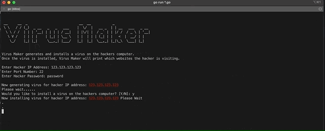

# Hacker Attacker

Hacker-attacker is a simulation exploit framework (like metasploit) which is intended to be used as a teaching aid to explain concepts behind Cybersecurity

## Local Builds
1. Make sure you have Go installed locally
```
brew install go
```
2. Clone this repo to your machine  
```
git clone https://github.com/leftrightleft/hacker-attacker.git
```
3. Run the app
```
cd hacker-attacker/cmd/instance
go run *.go
```

## Demo
